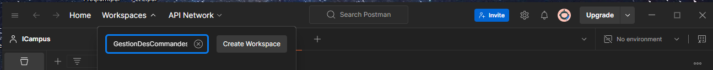
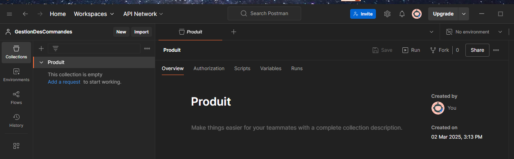
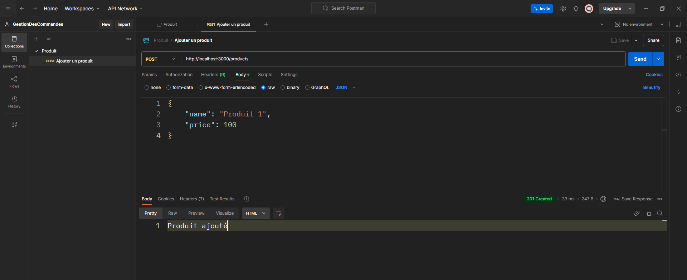
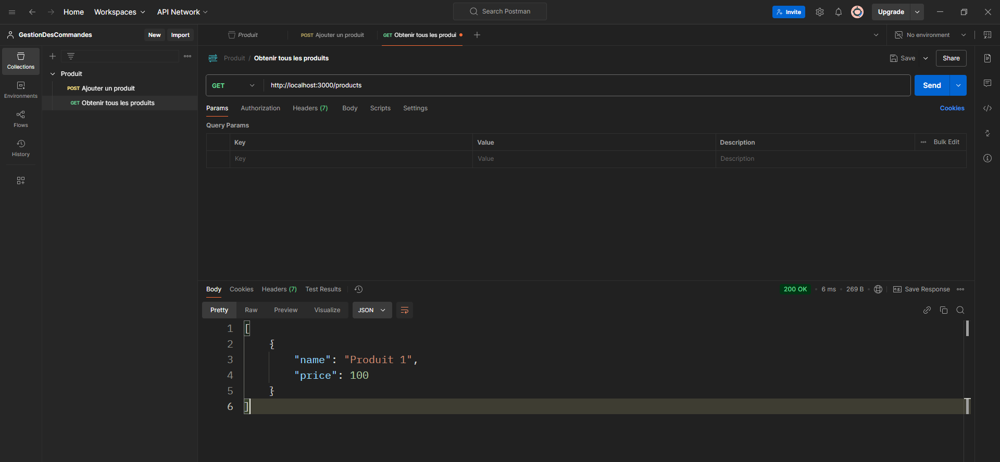
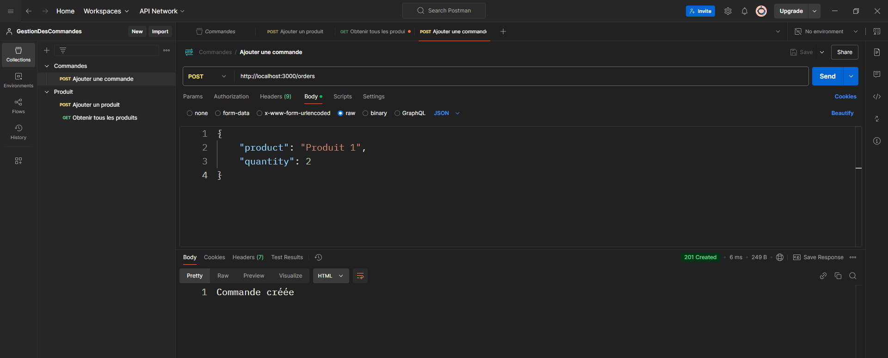
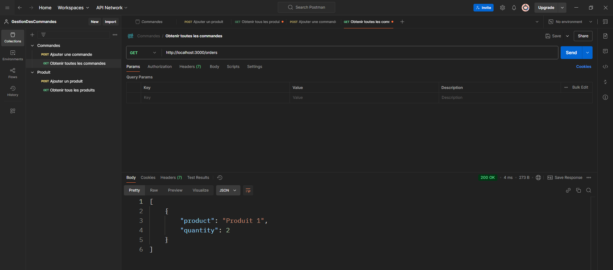

# Travaux Pratiques 1 : Comprendre l'asynchrone avec `Future` en Dart et API REST avec Node.js

## Objectifs du TP :
1. **Comprendre la gestion de l'asynchronisme** : Apprendre à travailler avec les méthodes `async` et `await` de Dart ainsi qu'avec les `Future`.
2. **Créer une API REST avec Node.js et Express.js** : Apprendre à développer un serveur backend permettant de gérer des produits et des commandes via une API REST.
3. **Tester l'API avec Postman** : Vérifier les bonnes pratiques du backend en testant l'API à l'aide de Postman.
4. **Consommer une API REST avec Dart** : Écrire un client Dart qui interagit avec l'API REST afin de récupérer et envoyer des données.

---

## Partie 1 : Création du Backend API

---

### 1. Initialisation du projet Node.js

**1.1 Créez un répertoire pour le projet backend** :

```bash
mkdir tp-backend
cd tp-backend
```
**1.2 Initialisez un nouveau projet Node.js :** :
```bash
npm init -y
```
Cette commande va générer un fichier package.json dans lequel toutes les informations liées aux dépendances du projet sont stockées.

**1.3 Installez les dépendances nécessaires :** :
```bash
npm install express body-parser fs
```
1. **express** : Framework pour créer le serveur HTTP.
2. **body-parser** : Middleware permettant d'analyser les données dans les requêtes POST.
3. **fs** : Module natif de Node.js pour lire et écrire des fichiers.

## 2. Créer le serveur Express.js

### 2.1 Créez un fichier server.js :

Dans le répertoire de votre projet, créez un fichier `server.js` :
```js
const express = require('express');
const bodyParser = require('body-parser');
const fs = require('fs');

const app = express();
const port = 3000;

// Utilisation du body parser pour analyser le JSON dans les requêtes POST
app.use(bodyParser.json());

// Charger les données depuis le fichier JSON
const loadData = () => {
  const data = fs.readFileSync('data.json', 'utf8');
  return JSON.parse(data);
};

// Sauvegarder les données dans le fichier JSON
const saveData = (data) => {
  fs.writeFileSync('data.json', JSON.stringify(data, null, 2));
};

// Tester si le serveur fonctionne
app.get('/', (req, res) => {
  res.send('API Backend fonctionne!');
});

app.listen(port, () => {
  console.log(`Serveur API démarré sur http://localhost:${port}`);
});

```
* Le serveur est configuré pour écouter sur le port 3000.
* Nous avons défini des fonctions `loadData` et `saveData` pour manipuler les données dans un fichier JSON.


### 2.2 Créez un fichier data.json :

Dans votre répertoire de projet, créez un fichier vide appelé `data.json`. Ce fichier servira à stocker les produits et les commandes en format JSON. Vous pouvez initialiser ce fichier avec le contenu suivant :

```json
{
  "products": [],
  "orders": []
}
```

### 2.3 Définir les routes pour les produits et commandes :
Dans le fichier `server.js`, ajoutez les routes suivantes :

```javascript
// Route GET pour obtenir tous les produits
app.get('/products', (req, res) => {
  const data = loadData();
  res.json(data.products);
});

// Route POST pour ajouter un produit
app.post('/products', (req, res) => {
  const data = loadData();
  const newProduct = req.body; // Assurez-vous que les données du produit sont envoyées dans le corps de la requête
  data.products.push(newProduct);
  saveData(data);
  res.status(201).send('Produit ajouté');
});

// Route GET pour obtenir toutes les commandes
app.get('/orders', (req, res) => {
  const data = loadData();
  res.json(data.orders);
});

// Route POST pour ajouter une commande
app.post('/orders', (req, res) => {
  const data = loadData();
  const newOrder = req.body; // Assurez-vous que les données de la commande sont envoyées dans le corps de la requête
  data.orders.push(newOrder);
  saveData(data);
  res.status(201).send('Commande créée');
});
```

**Explications :**

* La route `GET /products` renvoie tous les produits enregistrés dans `data.json`.
* La route `POST /products` permet d'ajouter un nouveau produit dans la liste.
* La route `GET /orders` renvoie toutes les commandes.
* La route `POST /orders` permet de créer une nouvelle commande.

## 3. Tester l'API avec Postman

### 3.1 Lancez le serveur :

Dans votre terminal, démarrez le serveur avec la commande suivante :

```bash
node server.js
```

### 3.2 Installation et Configuration du Postman :

**1. Téléchargement de Postman**

1.  Ouvre ton navigateur web et va sur le site officiel de Postman : [https://www.postman.com/downloads/](https://www.postman.com/downloads/).
2.  Clique sur le bouton de téléchargement correspondant à ton système d'exploitation (Windows, macOS, ou Linux).

**2. Création d'un Nouveau Workspace**

1. **Ouvrir Postman**.
2. Dans la barre latérale de gauche, cliquez sur l'onglet **Workspaces**.
3. Cliquez sur le bouton **Create a Workspace**.
4. Dans la fenêtre qui s'ouvre, remplissez les informations suivantes :
   - **Nom** : Entrez le nom de votre workspace (par exemple, `GestionDesCommandes`).
   - **Type de Workspace** : Choisissez `Personnel` ou `Équipe`, selon vos besoins.
   - **Description** : Optionnellement, entrez une description (par exemple, `Workspace pour gérer les produits et les commandes`).
5. Cliquez sur **Create Workspace**.



**3. Création des Collections pour Produit et Commande**

✅Création de la Collection "Produit"

1. Allez dans le workspace que vous venez de créer.
2. Dans la barre latérale de gauche, sous la section **Collections**, cliquez sur **New Collection**.
3. Dans la fenêtre qui apparaît :
   - **Nom de la Collection** : Entrez `Produit`.
   - **Description** : Ajoutez une description (par exemple, `API pour gérer les produits`).
4. Cliquez sur **Create**.



On peut maintenant ajouter des requêtes liées aux opérations sur les produits (par exemple, `POST /produits`, `GET /produits`, etc.) dans cette collection.

---

✅Création de la Collection "Commande"

1. Dans le même workspace, cliquez de nouveau sur **New Collection**.
2. Pour le **Nom de la Collection**, entrez `Commande`.
3. Ajoutez une description (par exemple, `API pour gérer les commandes`).
4. Cliquez sur **Create**.

### 3.3 Testez l'API avec Postman :

**1️⃣ Ajouter un produit :**

* Méthode : `POST`
* URL : `http://localhost:3000/products`
* Corps de la requête (en JSON) :

```json
{
    "name": "Produit 1",
    "price": 100
}
```



**2️⃣Obtenir tous les produits :**

* Méthode : `GET`
* URL : `http://localhost:3000/products`



**3️⃣Ajouter une commande :**

* Méthode : `POST`
* URL : `http://localhost:3000/orders`
* Corps de la requête (en JSON) :

```json
{
    "product": "Produit 1",
    "quantity": 2
}
```



**4️⃣Obtenir toutes les commandes :**

* Méthode : `GET`
* URL : `http://localhost:3000/orders`




## 4. Créer un client http Dart
L'objectif de cette partie est d'utiliser Dart pour envoyer des requêtes HTTP afin de récupérer et ajouter des produits et des commandes.

### 4.1. Configurer le projet Dart

1️⃣ Créez un nouveau dossier pour votre projet Dart si ce n'est pas déjà fait.
2️⃣ Ajoutez le package `http` à votre fichier `pubspec.yaml` pour activer les requêtes HTTP.

```yml
name: api_client
description: A simple API client in Dart

environment:
  sdk: ">=2.12.0 <3.0.0"

dependencies:
  http: ^0.13.3

# Cette section définit les exécutables pour les applications CLI
executables:
  api_client:
    script: client.dart
```

3️⃣ Créez un fichier client.dart dans votre projet

```bash
my_project/
├── main.dart  
├── pubspec.yaml
```
4️⃣ Ensuite, exécutez la commande suivante pour installer la dépendance :

```bash
dart pub get
```

### 4.2 Importation des bibliothèques nécessaires
```dart
import 'dart:convert'; // Pour convertir les données JSON en objets Dart et vice versa
import 'dart:io'; // Pour gérer les entrées/sorties, notamment les requêtes HTTP
import 'package:http/http.dart' as http; // Pour effectuer des requêtes HTTP (GET, POST, etc.)
```

### 4.3 Obtenir tous les produits

**Tâche**
Dans cette tâche, nous enverrons une requête HTTP GET au serveur pour récupérer la liste des produits. Si la requête réussit, nous afficherons chaque produit avec son nom et son prix. Si la requête échoue, nous afficherons un message d'erreur indiquant que la récupération des produits a échoué.

```dart
Future<void> getProducts(String baseUrl) async {
  final response = await http.get(Uri.parse('$baseUrl/products'));

  if (response.statusCode == 200) {
    List<dynamic> products = jsonDecode(response.body);
    print('Produits disponibles:');
    for (var product in products) {
      print('Nom: ${product['name']}, Prix: ${product['price']}');
    }
  } else {
    print('Erreur lors de la récupération des produits');
  }
}
```

### 4.4 Ajouter un nouveau produit

**Tâche**
Dans cette tâche, nous envoyons une requête HTTP POST pour ajouter un produit à l'API. Le produit est envoyé dans le corps de la requête sous forme de données JSON. Si l'ajout est effectué avec succès, un message de confirmation est affiché. Si une erreur se produit lors de l'ajout du produit, un message d'erreur est affiché.

```dart
Future<void> addProduct(String baseUrl, Map<String, dynamic> product) async {
  final response = await http.post(
    Uri.parse('$baseUrl/products'),
    headers: {HttpHeaders.contentTypeHeader: 'application/json'},
    body: jsonEncode(product),
  );

  if (response.statusCode == 201) {
    print('Produit ajouté avec succès');
  } else {
    print('Erreur lors de l\'ajout du produit');
  }
}
```


### 4.5 Obtenir toutes les commandes 

**Tâche**
Dans cette tâche, nous envoyons une requête HTTP GET pour récupérer la liste de toutes les commandes. Si la requête réussit, chaque commande sera affichée avec le nom du produit et la quantité commandée. Si une erreur survient, un message d'erreur sera affiché indiquant que la récupération des commandes a échoué.

```dart
Future<void> getOrders(String baseUrl) async {
  final response = await http.get(Uri.parse('$baseUrl/orders'));

  if (response.statusCode == 200) {
    List<dynamic> orders = jsonDecode(response.body);
    print('Commandes disponibles:');
    for (var order in orders) {
      print('Produit: ${order['product']}, Quantité: ${order['quantity']}');
    }
  } else {
    print('Erreur lors de la récupération des commandes');
  }
}
```


### 4.6 Ajouter une nouvelle commande

**Tâche**
Cette tâche consiste à envoyer une requête HTTP POST pour créer une nouvelle commande dans l'API. Le produit et la quantité de la commande sont envoyés sous forme de JSON dans le corps de la requête. Si la commande est créée avec succès, un message de confirmation est affiché. En cas d'erreur, un message indiquant l'échec de la création de la commande est affiché.

```dart
Future<void> addOrder(String baseUrl, Map<String, dynamic> order) async {
  final response = await http.post(
    Uri.parse('$baseUrl/orders'),
    headers: {HttpHeaders.contentTypeHeader: 'application/json'},
    body: jsonEncode(order),
  );

  if (response.statusCode == 201) {
    print('Commande créée avec succès');
  } else {
    print('Erreur lors de la création de la commande');
  }
}
```


### 4.7 Tester l'ensemble des fonctionnalités 

```dart
void main() async {
  // Base URL for the server
  final String baseUrl = 'http://localhost:3000';

  // Fetch all products
  await getProducts(baseUrl);

  // Add a new product
  final newProduct = {'name': 'Produit 1', 'price': 100};
  await addProduct(baseUrl, newProduct);

  // Fetch all orders
  await getOrders(baseUrl);

  // Add a new order
  final newOrder = {'product': 'Produit 1', 'quantity': 2};
  await addOrder(baseUrl, newOrder);
}
```

# 🛑 Save yourself from failing the exam! 🚨 

Votre mission consiste à créer une **API REST** en **Express.js**, basée sur le même modèle que **TD1**, permettant la gestion des **produits** et des **commandes**. Pour cela, vous devez :  

✅ Implémenter une route **GET** pour récupérer tous les produits.  
✅ Implémenter une route **POST** pour ajouter un nouveau produit.  
✅ Implémenter une route **GET** pour récupérer toutes les commandes.  
✅ Implémenter une route **POST** pour créer une nouvelle commande.  

Les données doivent être stockées dans un **fichier JSON**, et chaque modification doit être sauvegardée correctement. Ensuite, développez un **client en Dart** qui permet de :  

✅ Récupérer et afficher les produits via une requête **GET**.  
✅ Ajouter un produit via une requête **POST**.  
✅ Récupérer et afficher les commandes via une requête **GET**.  
✅ Ajouter une commande via une requête **POST**.  

## 💾 Partagez votre travail !  

Une fois votre projet terminé, **faites un fork** de ce dépôt et créez une **pull request** avec votre code pour montrer que vous avez accompli la mission. 🎯  

À vous de jouer ! 🚀🔥  


