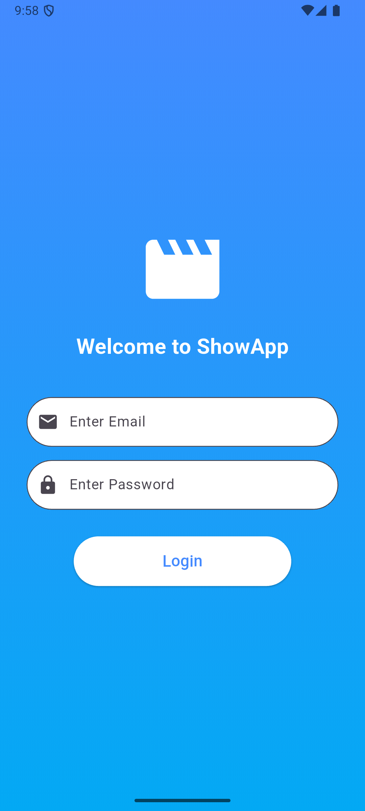
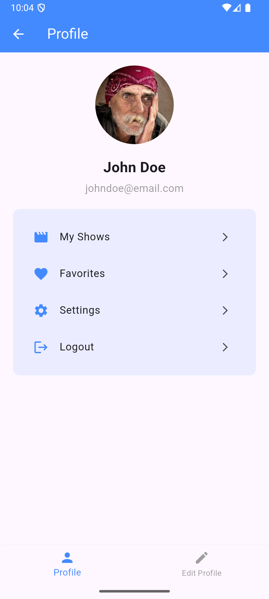
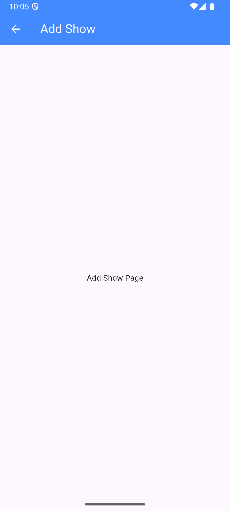

# TP2 - Développement d'une Application Mobile avec Flutter et un Backend Node.js

## Description
Ce TP a pour objectif de développer une application mobile en Flutter qui interagit avec un backend Node.js. L'application permettra aux utilisateurs d'afficher une liste de films, séries et animés, d'ajouter de nouveaux éléments, et de les supprimer via un balayage latéral avec confirmation.

## Objectifs
- Comprendre l'intégration entre une application Flutter et un backend RESTful en Node.js.
- Apprendre à structurer un projet Flutter avec navigation et gestion des états.
- Implémenter des fonctionnalités CRUD (Create, Read, Update, Delete) avec une interface utilisateur fluide.

## Plan du TP
1. **Préparation du Backend**  
   - Configuration de l'environnement Node.js et Express.  
   - Mise en place des routes API pour la gestion des "shows" (films, séries, animés).  
   - Implémentation du stockage des images envoyées par l'application.

2. **Création de l'Interface Statique en Flutter**  
   - Mise en place de la structure du projet Flutter.  
   - Création des différentes pages (Login, Accueil, Profil, Ajouter un Show).  
   - Navigation via un menu latéral (Drawer) et un menu inférieur (Bottom Navigation Bar).  

3. **Dynamisation de l'Application**  
   - Intégration de l'API backend pour afficher les données.  
   - Ajout des fonctionnalités d'ajout et de suppression avec confirmation.  
   - Sélection d'image depuis la galerie ou l’appareil photo pour l'ajout d'un show.

🚀 À la fin de ce TP, vous aurez une application fonctionnelle capable d’interagir avec un backend en temps réel !

## Préparation du Backend

### 1. Configuration du Projet

Commencez par initialiser un nouveau projet Node.js et installez les dépendances requises :
```bach
mkdir show-app-backend && cd show-app-backend
npm init -y
npm install express sqlite3 multer body-parser express-validator cors dotenv
```

Explication des dépendances :

* express : Framework pour la création d'API.
* sqlite3 : Base de données légère.
* multer : Middleware pour la gestion des uploads d'images.
* body-parser : Analyse les corps des requêtes entrantes.
* express-validator : Validation des entrées utilisateur.
* cors : Gestion des requêtes cross-origin.
* dotenv : Gestion des variables d'environnement.

### 2. Création du serveur (server.js)

Créez un fichier **server.js** qui servira de point d'entrée principal :

```javascript
require('dotenv').config();
const express = require('express');
const bodyParser = require('body-parser');
const cors = require('cors');
const showRoutes = require('./routes/shows');

const app = express();
const PORT = process.env.PORT || 5000;

app.use(cors());
app.use(bodyParser.json());
app.use('/uploads', express.static('uploads'));
app.use('/shows', showRoutes);

app.listen(PORT, () => {
  console.log(`Server is running on port ${PORT}`);
});
```

**Explication du fichier server.js**

* `dotenv`: Charge les variables d'environnement à partir d'un fichier `.env`.
* `express`: Initialise le serveur web.
* `body-parser`: Permet d'analyser les requêtes en JSON.
* `cors`: Active les requêtes cross-origin.
* `express.static`: Sert les fichiers statiques (images uploadées).
* Routes (`/shows`): Associe les routes pour gérer les shows.
* `app.listen`: Démarre le serveur sur le port spécifié.

### 3. Configuration de la Base de Données SQLite (database.js)

Ce fichier initialise la base de données SQLite.

```javascript
const sqlite3 = require('sqlite3').verbose();
const db = new sqlite3.Database('./shows.db');

db.serialize(() => {
  db.run(`
    CREATE TABLE IF NOT EXISTS shows (
      id INTEGER PRIMARY KEY AUTOINCREMENT,
      title TEXT NOT NULL,
      description TEXT NOT NULL,
      category TEXT CHECK(category IN ('movie', 'anime', 'serie')) NOT NULL,
      image TEXT
    )
  `);
});

module.exports = db;
```

**Explication du fichier database.js**

* `sqlite3`: Initialise une base de données SQLite.
* `db.serialize`: Exécute les commandes SQL de manière séquentielle.
* `CREATE TABLE IF NOT EXISTS`: Crée une table `shows` si elle n'existe pas.
* `PRIMARY KEY AUTOINCREMENT`: Chaque show a un ID unique auto-incrémenté.
* `CHECK(category IN (...))`: Restreint les valeurs de la catégorie (`movie`, `anime`, `serie`).

### 4. Création des Routes (routes/shows.js)

Ce fichier gère les opérations CRUD et la validation des images.

```javascript
const express = require('express');
const { body, param, validationResult } = require('express-validator');
const multer = require('multer');
const path = require('path');
const db = require('../database');

const router = express.Router();


const storage = multer.diskStorage({
  destination: './uploads/',
  filename: (req, file, cb) => {
    cb(null, `${Date.now()}-${file.originalname}`);
  }
});
const upload = multer({
  storage,
  fileFilter: (req, file, cb) => {
    const allowedTypes = /jpeg|jpg|png/;
    const extname = allowedTypes.test(path.extname(file.originalname).toLowerCase());

    cb(null, true);
/*     const mimetype = allowedTypes.test(file.mimetype);
    if (extname && mimetype) return cb(null, true);
    cb(new Error('Only images (JPG, PNG) are allowed!')); */
  }
});


const validateShow = [
  body('title').notEmpty().withMessage('Title is required'),
  body('description').notEmpty().withMessage('Description is required'),
  body('category').isIn(['movie', 'anime', 'serie']).withMessage('Category must be movie, anime, or serie')
];


router.post('/', upload.single('image'), validateShow, (req, res) => {
  const errors = validationResult(req);
  if (!errors.isEmpty()) {
    return res.status(400).json({ errors: errors.array() });
  }

  
  

  const { title, description, category } = req.body;
  const image = req.file ? `/uploads/${req.file.filename}` : null;

  console.log(req.body);
  console.log(image);
  db.run(
    'INSERT INTO shows (title, description, category, image) VALUES (?, ?, ?, ?)',
    [title, description, category, image],
    function (err) {
      if (err) return res.status(500).json({ error: err.message });
      res.status(201).json({ id: this.lastID, title, description, category, image });
    }
  );
});


router.get('/', (req, res) => {
  db.all('SELECT * FROM shows', [], (err, rows) => {
    if (err) return res.status(500).json({ error: err.message });
    res.json(rows);
  });
});


router.get('/:id', [
  param('id').isInt().withMessage('ID must be an integer')
], (req, res) => {
  const errors = validationResult(req);
  if (!errors.isEmpty()) {
    return res.status(400).json({ errors: errors.array() });
  }

  db.get('SELECT * FROM shows WHERE id = ?', [req.params.id], (err, row) => {
    if (err) return res.status(500).json({ error: err.message });
    if (!row) return res.status(404).json({ error: 'Show not found' });
    res.json(row);
  });
});


router.put('/:id', upload.single('image'), validateShow, (req, res) => {
  const errors = validationResult(req);
  if (!errors.isEmpty()) {
    return res.status(400).json({ errors: errors.array() });
  }

  const { title, description, category } = req.body;
  const image = req.file ? `/uploads/${req.file.filename}` : null;
  const id = req.params.id;

  db.run(
    'UPDATE shows SET title = ?, description = ?, category = ?, image = COALESCE(?, image) WHERE id = ?',
    [title, description, category, image, id],
    function (err) {
      if (err) return res.status(500).json({ error: err.message });
      if (this.changes === 0) return res.status(404).json({ error: 'Show not found' });
      res.json({ id, title, description, category, image });
    }
  );
});


router.delete('/:id', [
  param('id').isInt().withMessage('ID must be an integer')
], (req, res) => {
  const errors = validationResult(req);
  if (!errors.isEmpty()) {
    return res.status(400).json({ errors: errors.array() });
  }

  db.run('DELETE FROM shows WHERE id = ?', [req.params.id], function (err) {
    if (err) return res.status(500).json({ error: err.message });
    if (this.changes === 0) return res.status(404).json({ error: 'Show not found' });
    res.json({ message: 'Show deleted successfully' });
  });
});

module.exports = router;

```

### 5. Lancer le serveur
```bash
node server.js
```

**Explication du fichier routes/shows.js**

* `express.Router`: Crée un routeur pour gérer les endpoints `/shows`.
* `multer`: Configure le stockage et le filtrage des fichiers image (JPG, PNG).
* `express-validator`: Valide les entrées (`title`, `description`, `category`).
* **CRUD :**
    * `POST /shows`: Ajoute un show avec validation et image optionnelle.
    * `GET /shows`: Récupère tous les shows.
    * `GET /shows/:id`: Récupère un show spécifique.
    * `PUT /shows/:id`: Met à jour un show, en conservant l'image existante si aucune nouvelle n'est envoyée.
    * `DELETE /shows/:id`: Supprime un show.


## Création de l'Interface Statique en Flutter
### 1: Mise en place de la structure du projet Flutter
Dans lib/, créer un dossier screens/ pour organiser les pages :
```bash
lib/
│── main.dart
│── screens/
    ├── login_page.dart
    ├── home_page.dart
    ├── profile_page.dart
    ├── add_show_page.dart
```
### 2: Création des différentes pages
Créer les fichiers Dart suivants dans lib/screens/ avec les interfaces statiques.

#### 2.1 Page de Connexion (Login Page)




Créer login_page.dart :
```dart
import 'package:flutter/material.dart';
import 'home_page.dart';

class LoginPage extends StatelessWidget {
  const LoginPage({super.key});

  @override
  Widget build(BuildContext context) {
    return Scaffold(
      body: Container(
        width: double.infinity,
        padding: const EdgeInsets.symmetric(horizontal: 30),
        decoration: const BoxDecoration(
          gradient: LinearGradient(
            colors: [Colors.blueAccent, Colors.lightBlue],
            begin: Alignment.topCenter,
            end: Alignment.bottomCenter,
          ),
        ),
        child: Column(
          mainAxisAlignment: MainAxisAlignment.center,
          children: [
            const Icon(Icons.movie, size: 100, color: Colors.white),
            const SizedBox(height: 20),
            const Text(
              "Welcome to ShowApp",
              style: TextStyle(fontSize: 24, fontWeight: FontWeight.bold, color: Colors.white),
            ),
            const SizedBox(height: 40),
            TextField(
              decoration: InputDecoration(
                filled: true,
                fillColor: Colors.white,
                hintText: "Enter Email",
                prefixIcon: const Icon(Icons.email),
                border: OutlineInputBorder(borderRadius: BorderRadius.circular(30)),
              ),
            ),
            const SizedBox(height: 15),
            TextField(
              obscureText: true,
              decoration: InputDecoration(
                filled: true,
                fillColor: Colors.white,
                hintText: "Enter Password",
                prefixIcon: const Icon(Icons.lock),
                border: OutlineInputBorder(borderRadius: BorderRadius.circular(30)),
              ),
            ),
            const SizedBox(height: 30),
            ElevatedButton(
              style: ElevatedButton.styleFrom(
                backgroundColor: Colors.white,
                foregroundColor: Colors.blueAccent,
                padding: const EdgeInsets.symmetric(horizontal: 100, vertical: 15),
                shape: RoundedRectangleBorder(borderRadius: BorderRadius.circular(30)),
              ),
              onPressed: () {
                Navigator.pushReplacement(
                  context,
                  MaterialPageRoute(builder: (context) => const HomePage()),
                );
              },
              child: const Text("Login", style: TextStyle(fontSize: 18)),
            ),
          ],
        ),
      ),
    );
  }
}

```

**Explication:**

1. **Importations nécessaires :**
   - `import 'package:flutter/material.dart';` : Importe les composants nécessaires pour l'interface utilisateur Flutter.
   - `import 'home_page.dart';` : Importe la page d'accueil (HomePage) à laquelle l'utilisateur sera redirigé après la connexion.

2. **Déclaration de la classe `LoginPage` :**
   - La classe `LoginPage` est une **StatelessWidget**, ce qui signifie qu'elle ne gère pas d'état interne.
   - Le constructeur `const LoginPage({super.key});` permet de passer une clé au widget (utilisée pour optimiser la construction des widgets).

3. **Méthode `build` :**
   - La méthode `build` retourne un widget qui constitue l'interface graphique de la page de connexion.

4. **Scaffold :**
   - Le widget `Scaffold` est utilisé comme structure de base pour la page, fournissant des éléments tels qu'une `AppBar`, un `Drawer`, un `BottomNavigationBar`, etc.
   - Dans ce cas, il est utilisé pour afficher une structure de page avec un fond et un corps.

5. **Fond avec dégradé :**
   - Le `Container` a un fond en dégradé, allant de `Colors.blueAccent` à `Colors.lightBlue` (du bleu au bleu clair).
   - Le dégradé est défini avec `LinearGradient` et est orienté de haut en bas (`begin: Alignment.topCenter, end: Alignment.bottomCenter`).

6. **Colonne (Column) :**
   - Utilisation de `Column` pour empiler les widgets verticalement.
   - Le `mainAxisAlignment: MainAxisAlignment.center` centre les éléments verticalement sur l'écran.

7. **Icone et Texte :**
   - Une icône de film (`Icons.movie`) est affichée en haut de la page, suivie d'un texte de bienvenue ("Welcome to ShowApp").
   - L'icône a une taille de 100 et une couleur blanche.

8. **Champs de texte pour l'email et le mot de passe :**
   - **Champ pour l'email** : Le premier champ utilise `TextField` avec un icône d'email et un texte de "hint" pour guider l'utilisateur.
     - Il est rempli avec un fond blanc, et les coins sont arrondis avec `borderRadius: BorderRadius.circular(30)`.
   - **Champ pour le mot de passe** : Le deuxième champ utilise aussi `TextField`, mais avec la propriété `obscureText: true` pour masquer le texte saisi (utilisé pour le mot de passe).
     - Le style est similaire à celui du champ pour l'email.

9. **Bouton de connexion :**
   - Un bouton `ElevatedButton` est utilisé pour permettre à l'utilisateur de se connecter.
   - Le bouton a un fond blanc et un texte bleu (`backgroundColor: Colors.white, foregroundColor: Colors.blueAccent`).
   - Les coins du bouton sont arrondis avec `borderRadius: BorderRadius.circular(30)`.
   - Lorsqu'il est pressé, la méthode `Navigator.pushReplacement` est appelée pour rediriger l'utilisateur vers la `HomePage`.

10. **Gestion de la navigation :**
    - La méthode `Navigator.pushReplacement` permet de remplacer la page de connexion par la page d'accueil (`HomePage`) sans permettre à l'utilisateur de revenir à la page de connexion en utilisant le bouton "retour".
    - `MaterialPageRoute` est utilisé pour créer une transition vers la nouvelle page.

11. **Utilisation de `SizedBox` :**
    - `SizedBox(height: 20)` et d'autres instances sont utilisées pour ajouter des espacements verticaux entre les éléments de l'interface utilisateur.

**Points importants :**
- **Gestion du fond** avec un dégradé de couleur pour un design attrayant.
- **Utilisation de `TextField`** pour la saisie d'email et de mot de passe avec des icônes.
- **Navigation avec `Navigator.pushReplacement`** pour rediriger l'utilisateur après la connexion.
- **Personnalisation du bouton** avec un style spécifique et un arrondi des coins.

#### 2.2 Page d'Accueil (Home Page)


[](https://drive.google.com/file/d/1H3BlUoLsUJO-q45ENLnRNZQ4gRVyUQpV/view?usp=sharing)


Créer home_page.dart :

```dart
import 'package:flutter/material.dart';
import 'profile_page.dart';
import 'add_show_page.dart';

class HomePage extends StatefulWidget {
  const HomePage({super.key});

  @override
  _HomePageState createState() => _HomePageState();
}

class _HomePageState extends State<HomePage> {
  int _selectedIndex = 0;

  final List<Widget> _pages = [
    Center(child: Text("Movies Page", style: TextStyle(fontSize: 24))),
    Center(child: Text("Anime Page", style: TextStyle(fontSize: 24))),
    Center(child: Text("Series Page", style: TextStyle(fontSize: 24))),
  ];

  void _onItemTapped(int index) {
    setState(() {
      _selectedIndex = index;
    });
  }

  @override
  Widget build(BuildContext context) {
    return Scaffold(
      appBar: AppBar(title: const Text("Home")),
      drawer: Drawer(
        child: ListView(
          padding: EdgeInsets.zero,
          children: [
            const DrawerHeader(
              decoration: BoxDecoration(color: Colors.blue),
              child: Text("Menu", style: TextStyle(color: Colors.white, fontSize: 24)),
            ),
            ListTile(
              title: const Text("Profile"),
              onTap: () {
                Navigator.push(
                  context,
                  MaterialPageRoute(builder: (context) => const ProfilePage()),
                );
              },
            ),
            ListTile(
              title: const Text("Add Show"),
              onTap: () {
                Navigator.push(
                  context,
                  MaterialPageRoute(builder: (context) => const AddShowPage()),
                );
              },
            ),
          ],
        ),
      ),
      body: _pages[_selectedIndex],
      bottomNavigationBar: BottomNavigationBar(
        currentIndex: _selectedIndex,
        onTap: _onItemTapped,
        items: [
          BottomNavigationBarItem(
            icon: Icon(Icons.movie),
            label: "Movies",
          ),
          BottomNavigationBarItem(
            icon: Icon(Icons.animation),
            label: "Anime",
          ),
          BottomNavigationBarItem(
            icon: Icon(Icons.tv),
            label: "Series",
          ),
        ],
      ),
    );
  }
}

```

**Explication**

1. **Importations nécessaires :**
   - `import 'package:flutter/material.dart';` : Importe les composants nécessaires pour construire l'interface utilisateur Flutter.
   - `import 'profile_page.dart';` : Importe la page du profil utilisateur pour la navigation.
   - `import 'add_show_page.dart';` : Importe la page permettant d'ajouter des spectacles à l'application.

2. **Déclaration de la classe `HomePage` :**
   - La classe `HomePage` est un **StatefulWidget**, car elle gère un état interne (`_selectedIndex`) pour changer de page en fonction de l'élément sélectionné dans le `BottomNavigationBar`.
   - Le constructeur `const HomePage({super.key});` permet de passer une clé au widget (utile pour l'optimisation des widgets dans Flutter).

3. **État de la page (`_HomePageState`) :**
   - La classe `_HomePageState` contient la logique pour gérer l'état de la page d'accueil, notamment la gestion de la sélection d'un élément dans le `BottomNavigationBar`.
   - La variable `_selectedIndex` est utilisée pour suivre l'index de l'élément sélectionné (0 pour Movies, 1 pour Anime, 2 pour Series).

4. **Liste de pages :**
   - La liste `_pages` contient des widgets pour chaque page que l'utilisateur peut afficher en fonction de l'index sélectionné dans le `BottomNavigationBar`.
     - La première page affiche "Movies Page".
     - La deuxième page affiche "Anime Page".
     - La troisième page affiche "Series Page".

5. **Méthode `_onItemTapped` :**
   - La méthode `_onItemTapped(int index)` permet de mettre à jour l'index sélectionné (`_selectedIndex`) chaque fois qu'un élément du `BottomNavigationBar` est touché, ce qui entraîne la mise à jour de l'affichage de la page correspondante.

6. **Widget `Scaffold` :**
   - Le widget `Scaffold` fournit la structure de base de la page, incluant la `AppBar`, un menu latéral (`Drawer`), un corps pour afficher les pages, et une barre de navigation en bas (`BottomNavigationBar`).

7. **Barre d'Application (`AppBar`) :**
   - L'`AppBar` contient un titre simple "Home", qui s'affiche en haut de la page.

8. **Menu latéral (`Drawer`) :**
   - Le `Drawer` permet de naviguer vers différentes sections de l'application en utilisant une liste d'éléments :
     - Un `DrawerHeader` qui sert de section d'en-tête du menu avec un fond bleu et un texte "Menu".
     - Un `ListTile` pour naviguer vers la page de profil (`ProfilePage`).
     - Un autre `ListTile` pour naviguer vers la page d'ajout de spectacle (`AddShowPage`).

9. **Navigation vers d'autres pages :**
   - Lorsque l'utilisateur tape sur un élément du `Drawer` (comme "Profile" ou "Add Show"), la méthode `Navigator.push` est utilisée pour rediriger l'utilisateur vers la page correspondante (`ProfilePage` ou `AddShowPage`).

10. **Corps de la page (`body`) :**
    - Le corps de la page affiche l'élément correspondant à l'index sélectionné dans `_selectedIndex`, ce qui permet de changer de contenu en fonction de la sélection dans le `BottomNavigationBar`.

11. **Navigation en bas de la page (`BottomNavigationBar`) :**
    - Le `BottomNavigationBar` permet à l'utilisateur de naviguer entre les pages "Movies", "Anime" et "Series" en changeant l'index sélectionné.
    - Chaque élément du `BottomNavigationBar` est associé à une icône et un label :
      - `Icons.movie` pour "Movies"
      - `Icons.animation` pour "Anime"
      - `Icons.tv` pour "Series"
    - La méthode `onTap` est utilisée pour déclencher l'action lors de la sélection d'un élément, et la page affichée est mise à jour en fonction de l'index.

**Points importants :**
- **Gestion de la navigation** : Utilisation du `Drawer` pour accéder à différentes pages et du `BottomNavigationBar` pour naviguer entre les sections.
- **État avec `StatefulWidget`** : La gestion de l'état avec `_selectedIndex` permet de mettre à jour dynamiquement la page affichée.
- **Navigation avec `Navigator.push`** : Utilisation de cette méthode pour rediriger vers d'autres pages comme le profil ou l'ajout d'un spectacle.
- **Utilisation des Widgets Flutter** : `Scaffold`, `AppBar`, `Drawer`, `BottomNavigationBar`, et `Text` sont utilisés pour structurer l'interface et gérer la navigation.


### 2.3 Page de Profil (Profile Page)



Créer profile_page.dart :
```dart
import 'package:flutter/material.dart';

class ProfilePage extends StatefulWidget {
  const ProfilePage({super.key});

  @override
  _ProfilePageState createState() => _ProfilePageState();
}

class _ProfilePageState extends State<ProfilePage> {
  int _selectedIndex = 0;

  void _onItemTapped(int index) {
    setState(() {
      _selectedIndex = index;
    });
  }

  final List<Widget> _pages = [
    const ProfileView(),
    const UpdateProfileView(),
  ];

  @override
  Widget build(BuildContext context) {
    return Scaffold(
      appBar: AppBar(
        iconTheme: IconThemeData(color: Colors.white),
        title: const Text("Profile", style: TextStyle(color: Colors.white),),
        backgroundColor: Colors.blueAccent,
      ),
      body: _pages[_selectedIndex],
      bottomNavigationBar: BottomNavigationBar(
        currentIndex: _selectedIndex,
        onTap: _onItemTapped,
        selectedItemColor: Colors.blueAccent,
        unselectedItemColor: Colors.grey,
        items: const [
          BottomNavigationBarItem(icon: Icon(Icons.person), label: "Profile"),
          BottomNavigationBarItem(icon: Icon(Icons.edit), label: "Edit Profile"),
        ],
      ),
    );
  }
}

class ProfileView extends StatelessWidget {
  const ProfileView({super.key});

  @override
  Widget build(BuildContext context) {
    return Padding(
      padding: const EdgeInsets.all(20),
      child: Column(
        children: [
          const CircleAvatar(
            radius: 60,
            backgroundImage: NetworkImage('https://i.pravatar.cc/300'),
          ),
          const SizedBox(height: 20),
          const Text(
            "John Doe",
            style: TextStyle(fontSize: 22, fontWeight: FontWeight.bold),
          ),
          const SizedBox(height: 5),
          const Text(
            "johndoe@email.com",
            style: TextStyle(fontSize: 16, color: Colors.grey),
          ),
          const SizedBox(height: 20),
          Container(
            padding: const EdgeInsets.all(15),
            decoration: BoxDecoration(
              color: Colors.blueAccent.withOpacity(0.1),
              borderRadius: BorderRadius.circular(10),
            ),
            child: Column(
              children: [
                profileItem(Icons.movie, "My Shows"),
                profileItem(Icons.favorite, "Favorites"),
                profileItem(Icons.settings, "Settings"),
                profileItem(Icons.logout, "Logout"),
              ],
            ),
          ),
        ],
      ),
    );
  }

  Widget profileItem(IconData icon, String title) {
    return ListTile(
      leading: Icon(icon, color: Colors.blueAccent),
      title: Text(title),
      trailing: const Icon(Icons.arrow_forward_ios, size: 16),
      onTap: () {},
    );
  }
}

class UpdateProfileView extends StatefulWidget {
  const UpdateProfileView({super.key});

  @override
  _UpdateProfileViewState createState() => _UpdateProfileViewState();
}

class _UpdateProfileViewState extends State<UpdateProfileView> {
  final TextEditingController _nameController = TextEditingController();
  final TextEditingController _emailController = TextEditingController();

  @override
  void initState() {
    super.initState();
    _nameController.text = "John Doe";
    _emailController.text = "johndoe@email.com";
  }

  @override
  Widget build(BuildContext context) {
    return Padding(
      padding: const EdgeInsets.all(20),
      child: Column(
        children: [
          const Text(
            "Update Profile",
            style: TextStyle(fontSize: 22, fontWeight: FontWeight.bold),
          ),
          const SizedBox(height: 20),
          TextField(
            controller: _nameController,
            decoration: InputDecoration(
              labelText: "Full Name",
              prefixIcon: const Icon(Icons.person),
              border: OutlineInputBorder(borderRadius: BorderRadius.circular(10)),
            ),
          ),
          const SizedBox(height: 15),
          TextField(
            controller: _emailController,
            decoration: InputDecoration(
              labelText: "Email",
              prefixIcon: const Icon(Icons.email),
              border: OutlineInputBorder(borderRadius: BorderRadius.circular(10)),
            ),
          ),
          const SizedBox(height: 30),
          ElevatedButton(
            style: ElevatedButton.styleFrom(
              backgroundColor: Colors.blueAccent,
              foregroundColor: Colors.white,
              padding: const EdgeInsets.symmetric(horizontal: 100, vertical: 15),
              shape: RoundedRectangleBorder(borderRadius: BorderRadius.circular(10)),
            ),
            onPressed: () {
              ScaffoldMessenger.of(context).showSnackBar(
                const SnackBar(content: Text("Profile updated successfully!")),
              );
            },
            child: const Text("Save Changes", style: TextStyle(fontSize: 18)),
          ),
        ],
      ),
    );
  }
}

```

**Explication**

1. **Importations nécessaires :**
   - `import 'package:flutter/material.dart';` : Importe les composants nécessaires pour construire l'interface utilisateur Flutter.

2. **Classe `ProfilePage` :**
   - La classe `ProfilePage` est un **StatefulWidget**, car elle gère un état interne (`_selectedIndex`) pour changer de vue entre "Profile" et "Edit Profile".
   - Le constructeur `const ProfilePage({super.key});` permet de passer une clé au widget.

3. **État de la page (`_ProfilePageState`) :**
   - La classe `_ProfilePageState` contient la logique pour gérer l'état de la page de profil. Elle suit quel onglet est sélectionné (0 pour "Profile", 1 pour "Edit Profile").
   - La méthode `_onItemTapped(int index)` met à jour `_selectedIndex` à chaque fois qu'un élément du `BottomNavigationBar` est sélectionné.

4. **Liste des pages (`_pages`) :**
   - La liste `_pages` contient les deux vues principales : 
     - `ProfileView()` pour afficher le profil de l'utilisateur.
     - `UpdateProfileView()` pour permettre à l'utilisateur de modifier ses informations de profil.

5. **Widget `Scaffold` :**
   - Le `Scaffold` contient la structure de base de la page, avec l'**AppBar**, le **Body**, et le **BottomNavigationBar**.
   
6. **Barre d'application (`AppBar`) :**
   - L'`AppBar` affiche le titre "Profile" avec un fond bleu accentué.
   - L'icône de l'application (par défaut la flèche de retour) utilise la couleur blanche.

7. **Vue de profil (`ProfileView`) :**
   - Cette vue présente les informations de l'utilisateur (nom, email) et un avatar.
   - L'avatar est un `CircleAvatar` affichant une image de profil par défaut.
   - L'interface présente également une série d'éléments sous forme de **ListTile** permettant d'accéder à des sections telles que "My Shows", "Favorites", "Settings" et "Logout".
   - Chaque élément est associé à une icône et un texte.
   - La méthode `profileItem` crée un **ListTile** avec une icône et un titre, ainsi qu'une flèche pour la navigation.

8. **Vue de mise à jour du profil (`UpdateProfileView`) :**
   - La vue de mise à jour permet à l'utilisateur de modifier son nom et son email.
   - Deux `TextField` sont utilisés pour entrer le nom et l'email, avec des icônes d'illustration dans les champs de texte (`Icons.person` et `Icons.email`).
   - Un bouton `ElevatedButton` permet de sauvegarder les modifications. Lorsqu'on appuie sur ce bouton, un message de confirmation ("Profile updated successfully!") est affiché via un **SnackBar**.
   - Les informations de profil par défaut sont définies dans la méthode `initState` avec `_nameController.text` et `_emailController.text`.

9. **Barre de navigation en bas (`BottomNavigationBar`) :**
   - Le `BottomNavigationBar` permet de naviguer entre la vue du profil et la vue de mise à jour du profil.
   - Chaque élément est associé à une icône et un texte ("Profile" et "Edit Profile").
   - `selectedItemColor` est défini sur `Colors.blueAccent` pour indiquer l'élément sélectionné, et `unselectedItemColor` sur `Colors.grey` pour les éléments non sélectionnés.

**Points importants :**
- **Gestion de la navigation entre vues** : Utilisation de `BottomNavigationBar` pour basculer entre "Profile" et "Edit Profile". L'état est géré par `_selectedIndex`.
- **Présentation du profil** : L'utilisateur peut voir son avatar, son nom et son email dans la vue "Profile", et accéder à différentes options comme "My Shows", "Favorites", etc.
- **Mise à jour du profil** : Dans la vue "Edit Profile", l'utilisateur peut modifier son nom et email. La mise à jour est confirmée par un **SnackBar**.
- **Utilisation des `TextField` et `ElevatedButton`** : Les champs de texte permettent de saisir les informations, et le bouton "Save Changes" déclenche une action qui affiche une confirmation.
- **Modularité** : Les vues sont séparées en différentes classes (`ProfileView` et `UpdateProfileView`), ce qui facilite la gestion et l'extension de l'application.


### 3: age Ajouter un Show (Add Show Page)


Créer add_show_page.dart :
```dart
import 'package:flutter/material.dart';

class AddShowPage extends StatelessWidget {
  const AddShowPage({super.key});

  @override
  Widget build(BuildContext context) {
    return Scaffold(
      appBar: AppBar(
        iconTheme: IconThemeData(color: Colors.white),
        title: const Text("Add Show", style: TextStyle(color: Colors.white),),
        backgroundColor: Colors.blueAccent,
      ),

      body: const Center(child: Text("Add Show Page")),
    );
  }
}
```

### 3: Définir le point d’entrée de l’application
Mettre à jour main.dart :
```dart
import 'package:flutter/material.dart';
import 'screens/login_page.dart';

void main() {
  runApp(const ShowApp());
}

class ShowApp extends StatelessWidget {
  const ShowApp({super.key});

  @override
  Widget build(BuildContext context) {
    return MaterialApp(
      debugShowCheckedModeBanner: false,
      title: 'Show App',
      theme: ThemeData(
        primarySwatch: Colors.blue,
      ),
      home: const LoginPage(),
    );
  }
}

```


## Dynamisation de l'Application

Pour intégrer la dynamique à l'application, nous allons connecter l'interface avec l'API backend et ajouter les fonctionnalités d'ajout et de suppression des shows avec confirmation. Nous permettrons également aux utilisateurs de sélectionner une image depuis la galerie ou l’appareil photo.

### 1. Configuration de l'API

* Créez un fichier `api_config.dart` dans le dossier `config`.
* Ajoutez la classe `ApiConfig` qui contient l'URL de base de l'API :

```dart
class ApiConfig {
  static const String baseUrl = "http://10.0.2.2:5000";
}
```

### 2. Mise à jour de la page d'accueil pour récupérer les données depuis l'API

Modifier `HomePage` pour :

* Faire un appel API pour récupérer la liste des shows.
* Classer les shows en movies, anime et series.
* Afficher les shows sous forme de liste.
* Ajouter une fonctionnalité de suppression avec confirmation.

### 3. Ajout de la fonctionnalité de suppression d’un show

* Ajouter une fonction `deleteShow(int id)` pour envoyer une requête `DELETE` à l’API.
* Implémenter une boîte de dialogue de confirmation avant suppression.
* Mettre à jour la liste des shows après la suppression réussie.

```dart
import 'dart:convert';
import 'package:flutter/material.dart';
import 'package:http/http.dart' as http;
import 'package:show_app_backend/config/api_config.dart';
import 'package:show_app_backend/screens/add_show_page.dart';
import 'package:show_app_backend/screens/profile_page.dart';

class HomePage extends StatefulWidget {
  const HomePage({super.key});

  @override
  _HomePageState createState() => _HomePageState();
}

class _HomePageState extends State<HomePage> {
  int _selectedIndex = 0;
  List<dynamic> movies = [];
  List<dynamic> anime = [];
  List<dynamic> series = [];
  bool isLoading = true;

  @override
  void initState() {
    super.initState();
    fetchShows();
  }

  Future<void> fetchShows() async {
    final response = await http.get(Uri.parse('${ApiConfig.baseUrl}/shows'));

    if (response.statusCode == 200) {
      List<dynamic> allShows = jsonDecode(response.body);

      setState(() {
        movies = allShows.where((show) => show['category'] == 'movie').toList();
        anime = allShows.where((show) => show['category'] == 'anime').toList();
        series = allShows.where((show) => show['category'] == 'serie').toList();
        isLoading = false;
      });
    } else {
      setState(() => isLoading = false);
      throw Exception('Failed to load shows');
    }
  }

  Future<void> deleteShow(int id) async {
    final response = await http.delete(Uri.parse('${ApiConfig.baseUrl}/shows/$id'));

    if (response.statusCode == 200) {
      fetchShows(); // Refresh list after deletion
    } else {
      ScaffoldMessenger.of(context).showSnackBar(
        const SnackBar(content: Text("Failed to delete show")),
      );
    }
  }

  void confirmDelete(int id) {
    showDialog(
      context: context,
      builder: (context) => AlertDialog(
        title: const Text("Delete Show"),
        content: const Text("Are you sure you want to delete this show?"),
        actions: [
          TextButton(
            onPressed: () => Navigator.pop(context),
            child: const Text("Cancel"),
          ),
          TextButton(
            onPressed: () {
              Navigator.pop(context);
              deleteShow(id);
            },
            child: const Text("Yes, Delete"),
          ),
        ],
      ),
    );
  }

  Widget _getBody() {
    if (isLoading) {
      return const Center(child: CircularProgressIndicator());
    }

    switch (_selectedIndex) {
      case 0:
        return ShowList(shows: movies, onDelete: confirmDelete);
      case 1:
        return ShowList(shows: anime, onDelete: confirmDelete);
      case 2:
        return ShowList(shows: series, onDelete: confirmDelete);
      default:
        return const Center(child: Text("Unknown Page"));
    }
  }

  void _onItemTapped(int index) {
    setState(() {
      _selectedIndex = index;
    });
  }

  @override
  Widget build(BuildContext context) {
    return Scaffold(
      appBar: AppBar(title: const Text("Show App"), backgroundColor: Colors.blueAccent),
      drawer: Drawer(
        child: ListView(
          children: [
            const DrawerHeader(
              decoration: BoxDecoration(color: Colors.blueAccent),
              child: Text("Menu", style: TextStyle(color: Colors.white, fontSize: 24)),
            ),
            ListTile(
              leading: const Icon(Icons.person),
              title: const Text("Profile"),
              onTap: () => Navigator.push(context, MaterialPageRoute(builder: (builder)=>ProfilePage())),
            ),
            ListTile(
              leading: const Icon(Icons.add),
              title: const Text("Add Show"),
              onTap: () => Navigator.push(context, MaterialPageRoute(builder: (builder)=> AddShowPage())),
            ),
          ],
        ),
      ),
      body: _getBody(),
      bottomNavigationBar: BottomNavigationBar(
        items: const [
          BottomNavigationBarItem(icon: Icon(Icons.movie), label: "Movies"),
          BottomNavigationBarItem(icon: Icon(Icons.animation), label: "Anime"),
          BottomNavigationBarItem(icon: Icon(Icons.tv), label: "Series"),
        ],
        currentIndex: _selectedIndex,
        selectedItemColor: Colors.blueAccent,
        onTap: _onItemTapped,
      ),
    );
  }
}

class ShowList extends StatelessWidget {
  final List<dynamic> shows;
  final Function(int) onDelete;

  const ShowList({super.key, required this.shows, required this.onDelete});

  @override
  Widget build(BuildContext context) {
    if (shows.isEmpty) {
      return const Center(child: Text("No Shows Available"));
    }

    return ListView.builder(
      itemCount: shows.length,
      itemBuilder: (context, index) {
        final show = shows[index];
        return Dismissible(
          key: Key(show['id'].toString()),
          direction: DismissDirection.endToStart,
          background: Container(
            color: Colors.red,
            padding: const EdgeInsets.symmetric(horizontal: 20),
            alignment: Alignment.centerRight,
            child: const Icon(Icons.delete, color: Colors.white),
          ),
          onDismissed: (direction) => onDelete(show['id']),
          confirmDismiss: (direction) => onDelete(show['id']),
          child: Card(
            margin: const EdgeInsets.symmetric(horizontal: 10, vertical: 5),
            child: ListTile(
              leading: Image.network(
                ApiConfig.baseUrl + show['image'],
                width: 50,
                height: 50,
                fit: BoxFit.cover,
                errorBuilder: (context, error, stackTrace) =>
                const Icon(Icons.broken_image),
              ),
              title: Text(show['title'], style: const TextStyle(fontWeight: FontWeight.bold)),
              subtitle: Text(show['description']),
              trailing: IconButton(
                icon: const Icon(Icons.more_vert),
                onPressed: () {},
              ),
            ),
          ),
        );
      },
    );
  }
}

```

### 4. Mise en place de la fonctionnalité d'ajout d'un show

**Configuration des Permissions pour Android**  
1. Ouvrez le fichier **`android/app/src/main/AndroidManifest.xml`**.  
2. Ajoutez les permissions suivantes à l’intérieur de la balise `<manifest>` :  

```xml
   <uses-permission android:name="android.permission.CAMERA"/>
   <uses-permission android:name="android.permission.READ_EXTERNAL_STORAGE"/>
   <uses-permission android:name="android.permission.WRITE_EXTERNAL_STORAGE"/>
```
3. Assurez-vous que la ligne suivante est présente à l’intérieur de la balise <application> :
```xml
android:requestLegacyExternalStorage="true"
```

Installer la bibliothèque `image_picker` pour permettre la sélection d'images :

```sh
flutter pub add image_picker
```
* Ajouter un champ `title`, `description`, et `category` pour entrer les détails du show.
* Ajouter un bouton pour sélectionner une image depuis la galerie ou l’appareil photo:

    * Permettre à l’utilisateur de sélectionner une image depuis la galerie ou l’appareil photo.
    * Afficher un aperçu de l’image sélectionnée avant l’envoi.
    * Ajouter l’image au formulaire et l’envoyer avec la requête `POST`.

* Implémenter l’envoi des données au backend via une requête `POST`.
* Afficher un indicateur de chargement pendant l'envoi.
* Afficher un message de succès ou d’échec après l’ajout.


```dart
import 'dart:convert';
import 'dart:io';
import 'package:flutter/material.dart';
import 'package:image_picker/image_picker.dart';
import 'package:http/http.dart' as http;
import 'package:show_app_backend/config/api_config.dart';

class AddShowPage extends StatefulWidget {
  const AddShowPage({super.key});

  @override
  _AddShowPageState createState() => _AddShowPageState();
}

class _AddShowPageState extends State<AddShowPage> {
  final TextEditingController _titleController = TextEditingController();
  final TextEditingController _descriptionController = TextEditingController();
  String _selectedCategory = 'movie';
  File? _imageFile;
  final ImagePicker _picker = ImagePicker();
  bool _isUploading = false;

  Future<void> _pickImage(ImageSource source) async {
    final XFile? image = await _picker.pickImage(source: source);
    if (image != null) {
      setState(() {
        _imageFile = File(image.path);
      });
    }
  }

  Future<void> _addShow() async {
    if (_titleController.text.isEmpty || _descriptionController.text.isEmpty || _imageFile == null) {
      ScaffoldMessenger.of(context).showSnackBar(
        const SnackBar(content: Text("All fields are required!")),
      );
      return;
    }

    setState(() => _isUploading = true);

    var request = http.MultipartRequest('POST', Uri.parse('${ApiConfig.baseUrl}/shows'));
    request.fields['title'] = _titleController.text;
    request.fields['description'] = _descriptionController.text;
    request.fields['category'] = _selectedCategory;
    request.files.add(await http.MultipartFile.fromPath('image', _imageFile!.path));

    var response = await request.send();
    setState(() => _isUploading = false);


    if (response.statusCode == 201) {
      ScaffoldMessenger.of(context).showSnackBar(
        const SnackBar(content: Text("Show added successfully!")),
      );
      Navigator.pop(context, true); // Return to refresh home page
    } else {
      ScaffoldMessenger.of(context).showSnackBar(
        const SnackBar(content: Text("Failed to add show")),
      );
    }
  }

  @override
  Widget build(BuildContext context) {
    return Scaffold(
      appBar: AppBar(title: const Text("Add Show"), backgroundColor: Colors.blueAccent),
      body: Padding(
        padding: const EdgeInsets.all(16.0),
        child: Column(
          crossAxisAlignment: CrossAxisAlignment.start,
          children: [
            TextField(
              controller: _titleController,
              decoration: const InputDecoration(labelText: "Title"),
            ),
            const SizedBox(height: 10),
            TextField(
              controller: _descriptionController,
              maxLines: 3,
              decoration: const InputDecoration(labelText: "Description"),
            ),
            const SizedBox(height: 10),
            DropdownButtonFormField<String>(
              value: _selectedCategory,
              items: const [
                DropdownMenuItem(value: "movie", child: Text("Movie")),
                DropdownMenuItem(value: "anime", child: Text("Anime")),
                DropdownMenuItem(value: "serie", child: Text("Series")),
              ],
              onChanged: (value) => setState(() => _selectedCategory = value!),
              decoration: const InputDecoration(labelText: "Category"),
            ),
            const SizedBox(height: 10),
            _imageFile == null
                ? const Center(child: Text("No Image Selected"))
                : Image.file(_imageFile!, height: 150, fit: BoxFit.cover),
            const SizedBox(height: 10),
            Row(
              mainAxisAlignment: MainAxisAlignment.spaceEvenly,
              children: [
                ElevatedButton.icon(
                  onPressed: () => _pickImage(ImageSource.gallery),
                  icon: const Icon(Icons.image),
                  label: const Text("Gallery"),
                ),
                ElevatedButton.icon(
                  onPressed: () => _pickImage(ImageSource.camera),
                  icon: const Icon(Icons.camera),
                  label: const Text("Camera"),
                ),
              ],
            ),
            const SizedBox(height: 20),
            _isUploading
                ? const Center(child: CircularProgressIndicator())
                : SizedBox(
              width: double.infinity,
              child: ElevatedButton(
                onPressed: _addShow,
                style: ElevatedButton.styleFrom(backgroundColor: Colors.blueAccent),
                child: const Text("Add Show", style: TextStyle(color: Colors.white)),
              ),
            ),
          ],
        ),
      ),
    );
  }
}

```

## La vidéo complète du TP2

[](https://drive.google.com/file/d/18LVBgOQqj9okownSgCaXcqQK4MVXVkRu/view?usp=sharing)


# 🛑 Save yourself from failing the exam! 🚨 

Votre mission consiste à compléter les tâches suivantes et les soumettre via un dépôt GitHub personnel. Une fois terminé, envoyez le lien du dépôt par email.

### 📝 Tâches à compléter :

1️⃣ **Créer une Page de Mise à Jour (Update Show Page)**

* Implémenter une nouvelle page permettant de modifier un show existant.
* Pré-remplir les champs avec les informations du show sélectionné.
* Permettre la mise à jour du titre, de la description, de la catégorie et de l’image.
* Envoyer la mise à jour au backend via une requête `PUT`.

2️⃣ **Rendre la Page d'Accueil Dynamique (Auto-Refresh)**

* Mettre à jour la liste des shows automatiquement après un ajout ou une modification.
* Éviter de devoir recharger manuellement l’application pour voir les nouvelles données.
* Optimiser l’expérience utilisateur en rafraîchissant uniquement la partie concernée.

3️⃣ **Créer une Page de Connexion Fonctionnelle**

* Implémenter la page de connexion permettant aux utilisateurs de s'authentifier via l’API backend.
* Ajouter des champs pour l'email et le mot de passe.
* Afficher un message d’erreur en cas de mauvais identifiants.
* Stocker le token d’authentification après une connexion réussie pour les prochaines requêtes.

### 📂 Dépôt GitHub & Soumission

✅ Créer un dépôt GitHub personnel et y ajouter votre projet Flutter.
✅ Envoyer le lien du dépôt GitHub par email une fois le travail terminé.


